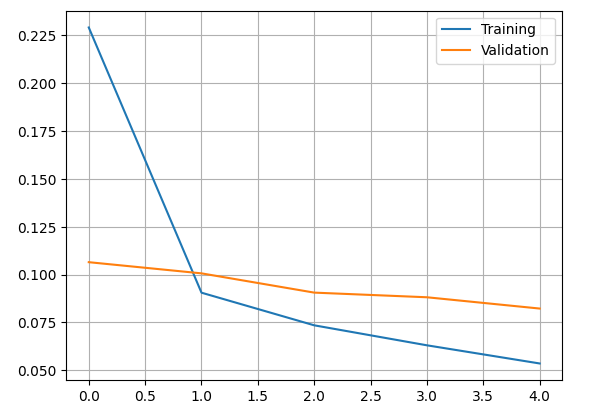
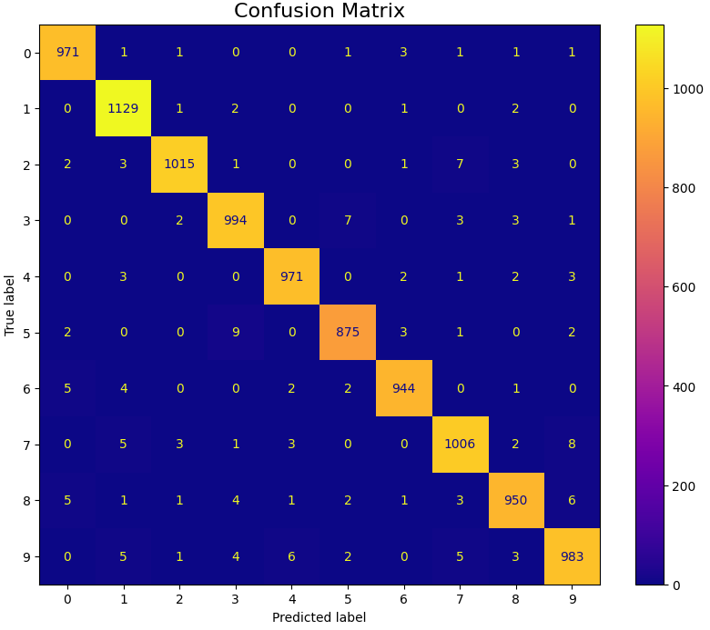

# Practical work 11 -  Convolutional Neural Networks 
## Students
- Liechti Matthieu
- Loup Olivia

## 1. Learning algorithm to train the neural networks
*What is the learning algorithm being used to train the neural networks?*

The learning algorithm used is this code is SGD (stochastic gradient descent).

*What are the parameters (arguments) being used by that algorithm?*

In this code we used the optimizer RMSprop. We also have diffrent parameters like :
- Batch-size = 128
- n_epoch = 20
- Learning_rate = 0.001
- Hidden neuron = 300

*What cost function is being used?*

The cost function (also referred to as the loss function) being used in your code is categorical crossentropy. The categorical crossentropy loss compares the predicted probability distribution with the true one-hot encoded label and computes the cross-entropy loss, which penalizes the model more if its predicted probability for the correct class is low.
`model.compile(loss='categorical_crossentropy', optimizer=RMSprop(), metrics=['accuracy'])`

## 2 Improvements. 
### 2.1 MLP_Raw

In the first time, we will play with the MLP_Raw notebook. We are going to try diffrent configuration to train this neural network. The first layer input is composed with 784 neurons. It's the number of pixels per image (28x28). Inbetween we have 300 hidden neurons and for the output we have 10 neurons. It correspond to the 10 features (digits) to recognize.
First we just run the code without modification. We obtains the following relusts:

- Validation accuracy: 0.9787999987602234
- Test accuracy: 0.9803000092506409

Then we just augment the number of "n_epoch" to 20 and we had a slightly better result :

- Validation accuracy: 0.9825000166893005
- Test accuracy: 0.9822999835014343

To continue the tests, we modify the number of hidden neurons to 1000.

We also try to add a dropout layer of 0.5.

The number of weights in this model can be calculated as follows: 
- In the hidden layer, each of the 1000 neurons is connected to each of the 784 neurons 
neurons. There are therefore 784 × 1000 = 784'000 weights. In addition, there are 1000 bias terms (one 
for each neuron), i.e. a total of 784'000 + 1000 = 785'000 parameters in the 
hidden layer. 
- In the output layer, each of the neurons (10) is connected to each of the 1000 
neurons in the hidden layer. So there are 1000 × 10 weights plus bias terms for each class. 
each class, giving a total of 1000 × 10 + 10 parameters in the output layer. 
The total number of parameters in the network is therefore 785,000 + 1000 × 10 + 10 = 
795'010. The dropout layer adds no weight to the model.

To finish this first notebook we try to augment the number of epoch to 50.

The final result with the test set is :

- Test score: 0.07585226744413376
- Test accuracy: 0.984499990940094

The diagonal is visible and reflects the good performance of the model, which had no trouble finding the right digits.  There are a few errors, but never more than 10. The biggest confusion seems to be between “9” and “4” + “3” and “5”, without appearing high.

### 2.1 MLP_HOG

Like the previous notebook, the dataset used is MNIST (digits between 0 and 9). However, this time the HOG feature method is applied to recognize image features rather than raw inputs (28x28) directly. 
The same sets and their distribution are similar to Exercise 1.
The starting parameters are the following :

- Pixel per Cell : 4
- Orientation : 8
- Epoch : 5
- Batch size : 128
- Hidden neurons : 300
- Optimizer : RMSprop

The model is a simple MLP (feed-forward network) with a hidden layer layer and an output layer using the softmax activation function. For the input we have a vector size of 1568 and the number ouf outpu is equal to the number of features.

The result of the first run shows an accuracy on the validation set of 0.9743000268936157.

As in the last Notebook, we modify the number of Epoch. 

For a number of Epoch of 80, we can clearly see the convergence but we can see tha the validation curve tend to augment. It probably mean that we have little overfitting. 
For the following test we reduce the number of Epoch and we add a dropout to the model.(Epoch = 20)

The accuracy is very close to the last test. To finish we juste augment the number of hidden neurons. (1000)

We can see that we have almost the same result as the MLP_Raw. The final accuracy on the test Set is :0.9837999939918518. The confusion matrix show the same caracteristics as the last one. 
The calculation is carried out in exactly the same way as for the raw inputs with 1568 inputs instead of 784. The result is given by the following calculation: 
1568 × 1000 + 1000 + 1000 × 10 + 10 = 1'579'010 parameters.

## 3. Shallow ones VS deep neural network
*Do the deep neural networks have much more “capacity” (i.e., do they have more
weights?) than the shallow ones? explain with one example.*

The shallow are limited by the number of layer, in case this bring less capacity 
to learning than the deep neural network. Moreover by this limit of numbers of 
layer, this system could have less weight than the deep neural network.

In example with an object detection in image, shallow ones will be limited with 
one layer
and detected multiple layer to find an object could be complicate if the image 
is to "rich". With the case of deep neural network, this could be easier because
it could use more layer so have more weight and more risk of overfitting.
## 4. CNN with pneumonia 
*Train a CNN for the chest x-ray pneumonia recognition. In order to do so, complete
the code to reproduce the architecture plotted in the notebook. Present the
confusion matrix, accuracy and F1-score of the validation and test datasets and
discuss your results.*
### validation set
The F1-score are : 0.667\
It's not really the best.
When we see the number of data, it's few values. Maybe use more could be more 
relevant.
This could be a result of the number of epoch or layer.

Matrix :

### test set
The F1-score are : 0.769
The score are better.

Matrix :

### validation set VS test set 
The F1-score of test set are bigger than validation set.
It could have a relation with the number of parameters.
In général, the score are good but the best.
It could be interesting to use more epoch or change the layer.
The risk is to bring overfitting and reduce sscore. Moreover,
the time to wait about model could be really big.
