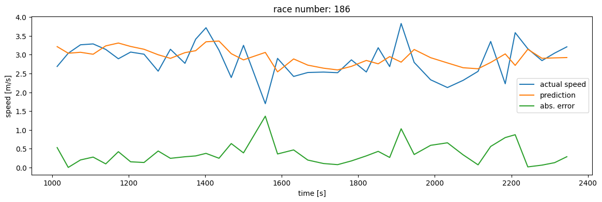
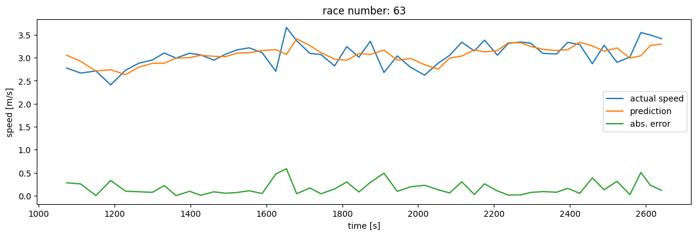
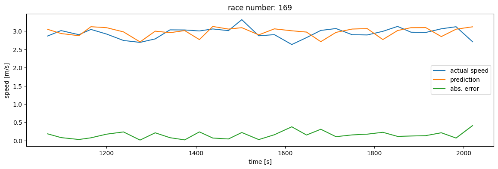

# Practical work 12 - Recurrent Neural Networks
## Students
- Liechti Matthieu
- Loup Olivia 

## Work to do and report
### 1. 
Explore different number of LSTM units, different lengths of previous data (sequence
length) and training epochs. Show the configuration that performed the best. Observe the
resulting complexity of the network (e.g., number of trainable parameters).

We define the parameters :
- sequence length : 40
- epoch : 80
- units : 12

The *sequence length* have impact to increase correlation coefficient of train set but more decrease test length.

But this give also better result on predicition with values of error under 1.
### 2. 
What is the largest error (speed prediction) you observed? Do you observe that most of
those large errors show up for high speeds ? or low speeds? Why?

*Largest error observed was less than one with parameters define in ex1. 
The bigger error was not dependend of fast or slow but of difference between 
previous speed. This could say the more source of larger error is the big 
difference of speed (acceleration or deceleration) than high or low speed.*
Big decceleration:

Big acceleration (and decceleration too):

And a case without big difference of speed:

We could observe most of effect with big change.
### 3. 
Using the predicted speeds for a given race, compute the expected time for a race and
compute the difference between the real race time and the predicted race time in minutes.
Provide the code of the cell that computes this prediction error. 

*Response*