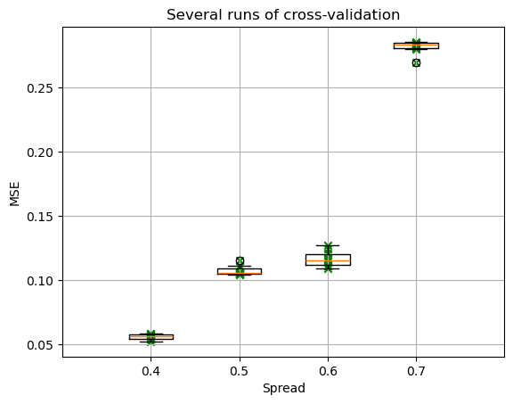
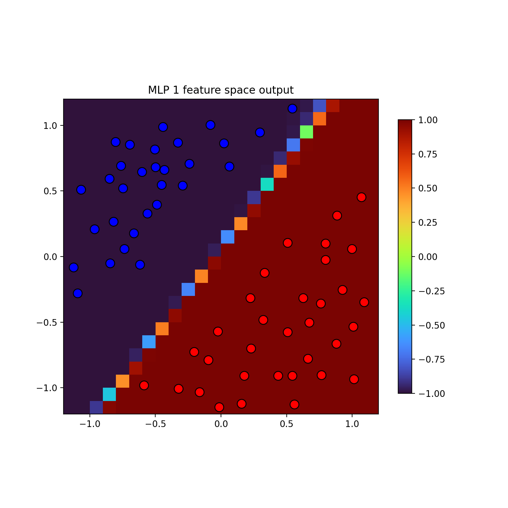
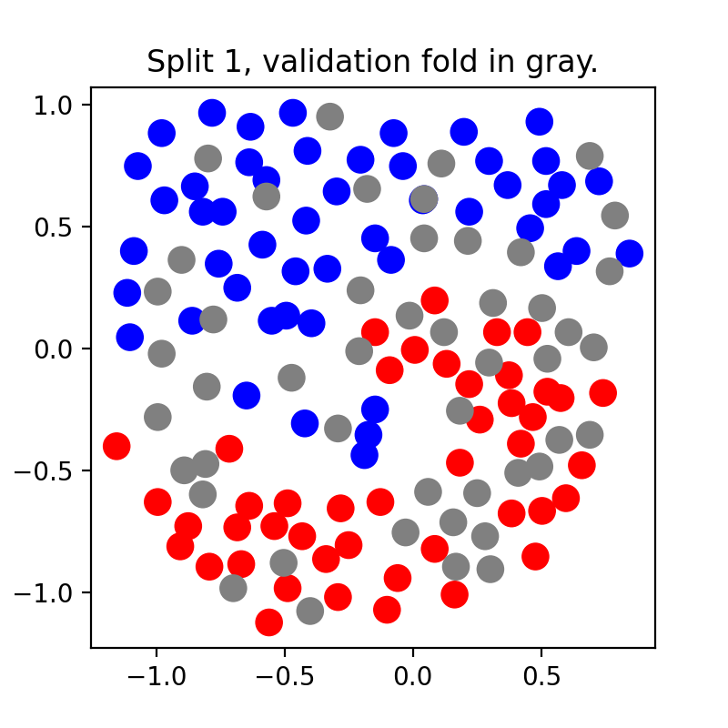
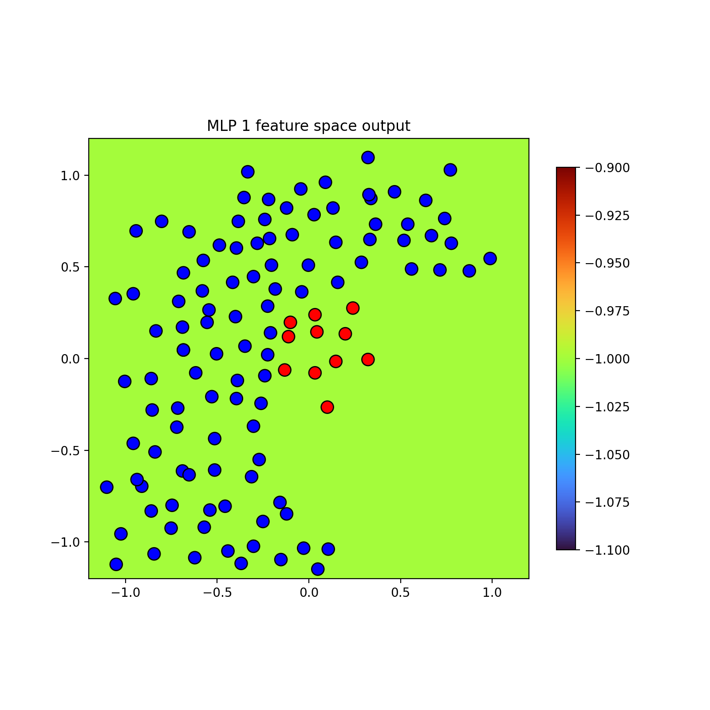
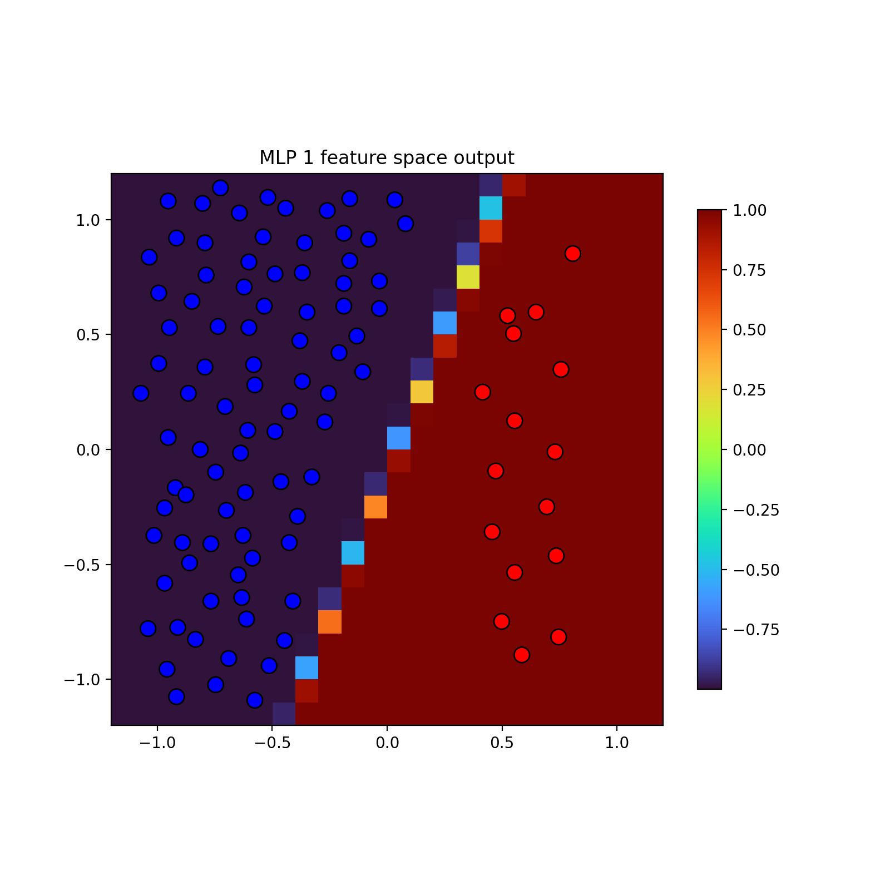

# Practical work 10 - Artificial Neural Networks (ANN)
## Students
- Liechti Matthieu
- Loup Olivia
## Summary of work to include in the report
- Answer questions 1-3 from the *3_delta_rule_points* notebook and present the resulting
plot when the option SHOW_VIDEO is set to False.
- Run notebook 5, provide the final plots *MSE vs spread* and comment the difference
between results.
- Run notebook 7 and provide the chosen hyperparameters for each of the three dataset
types. Test on three dataset types: balanced with clear separation, balanced with mixed
classes, and unbalanced. Present the top three experiments per dataset with metrics like
confusion matrices and summarize your findings
## Notebook 3 : *3_delta_rule_points*
### Q1. What happens if the boundaries between both classes are well defined?
### Q2. What happens if the classes overlap? What could you say about oscillations in the error signal?
### Q3. What happens if it is not possible to separate the classes with a single line? What could you say about local minima?

## Notebook 5 : *5_cross_validation*

### Comparaison MSE vs Spread
for MSE smaller than 0.15, the result are quite both. The box are smaller for 
small values of MSE and Spread, this seem to present 
Distribution seem symetric for more case (not in spread 0.5)
the boxes in spread(0.4;0.6) have not aberrant values (out of minimum or maximum).\
Box in spread(0.6) has more maximum than the other and bigger than the minimum of box,
this box is the biggest so they have more of data to correspond at.\
The spread(0.4) seems havee better result because is the smaller value of MSE 
and all values are next to the mean. Normaly at this values, it must be simplify to separate.

## Notebook 7 : *7_mlp_keras*
### Exercise

Please try changing hyperparameters (number of neurons, number of layers, learning rate, momentum, number of epochs...) and observe the impact it has on training and validation loss, convergence, and computation time. For instance, observe if there's overfitting if you put a high number (i.e. 128) of neurons in the hidden layer.

Experiment with 3 Different Datasets:
Apply the above parameter tuning on three distinct types of datasets:
- Balanced dataset with clear separation between classes.
- Balanced dataset with mixed or overlapping classes.
- Unbalanced dataset (e.g., one class significantly larger than the others).

For each dataset type, select and present the three best experiments (with tuned hyperparameters). Provide relevant results such as confusion matrices and other metrics, and analyze the effects on loss, convergence, computation time, and overfitting.

### Balanced dataset with clear separation between classes.
The sepration is easy, it's difficult to see overfitting.

1. ``hidden-layer=8`` & ```learning_rate = 0.9```, ```momentum = 0.0001``` val
   1. F1-score all : 1.0
2. ``hidden-layer=2`` & ```learning_rate = 0.8```, ```momentum = 0.0001``` val
   1. F1-score all : 1.0 
3. ``hidden-layer=1`` & ```learning_rate = 0.9```, ```momentum = 0.0001```val
   1. F1-score all : 1.0 
### Balanced dataset with mixed or overlapping classes.
\
*PS: I forgott to take at right moment*
1. ``hidden-layer=4`` & ```learning_rate = 0.9```, ```momentum = 0.0001``` val
   1. F1-score all : 0.9418181818181819
2. ``hidden-layer=8`` & ```learning_rate = 0.8```, ```momentum = 0.0001``` val
   1. F1-score all : 0.9934640522875817 - 1.0
3. ``hidden-layer=8`` & ```learning_rate = 0.9```, ```momentum = 0.0001```val
   1. F1-score all : 0.9629629629629629 $\rightarrow$ overfitting

With 128 hidden layer, the F1-score decrease so they have overfitting 
(F1-score : 0.9528943652932872)

### Unbalanced dataset (e.g., one class significantly larger than the others).
Data :\

1. ``hidden-layer=8`` & ```learning_rate = 0.8```, ```momentum = 0.0001``` val
   1. F1-score all : 0.2857142857142857 
2. ``hidden-layer=8`` & ```learning_rate = 0.8```, ```momentum = 0.0001``` val
   1. F1-score all : 0.6190476190476191
3. ``hidden-layer=8`` & ```learning_rate = 0.9```, ```momentum = 0.0001```val
   1. F1-score all : 0.0

For same parameters, F1-score could be extremly different, this means the data are 
to variable because of difference. If the data was more separate (like exemple 
above) the result could be better.\
